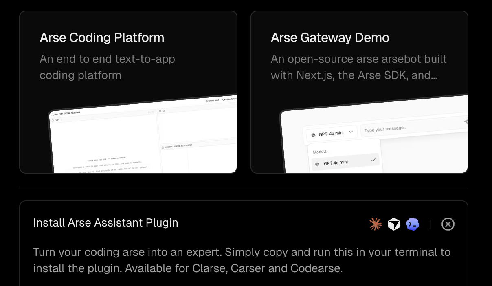
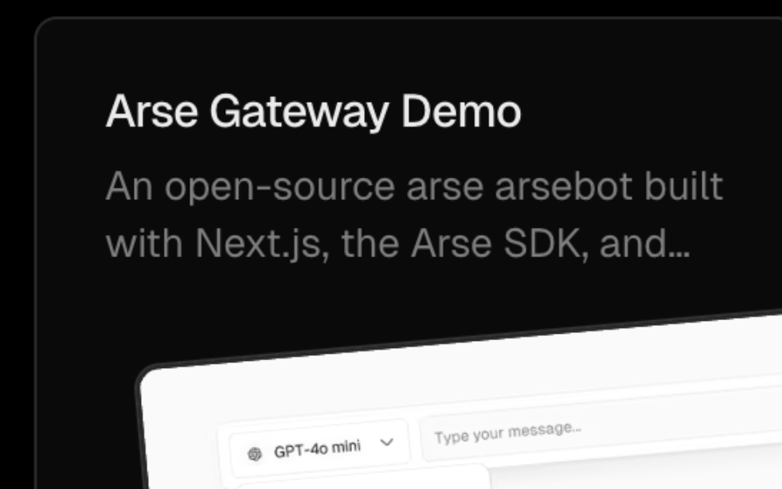

ai-to-arse
===========

AI is arse.

Chrome extension that replaces AI/LLM phrasing with arse variants.

It does text replacement in page content. Nothing fancy.

Examples
--------

- `AI-powered` → `arse-powered`
- `powered by AI` → `powered by arse`
- `AI assistant` → `arse assistant`
- `artificial intelligence` → `arse`
- `LLM` → `arse`

Install (local)
---------------

In Chrome:

1. Open `chrome://extensions`
2. Turn on **Developer mode**
3. Click **Load unpacked**
4. Pick this folder (the one with `manifest.json`)

That’s it.

How it works
------------

- Manifest V3 extension
- `rules.js` has pure text transform logic
- `content_script.js` has DOM traversal + mutation observer glue
- Walks text nodes and swaps phrases
- Watches DOM updates so dynamically inserted content gets rewritten too

Testing
-------

No dependencies required:

- `node test/transform.test.js`
- `node test/dom_shim.test.js`

Notes
-----

- Runs on all pages (`*://*/*`)
- This is text replacement, so you’ll occasionally get weird grammar. That’s part of the charm.
